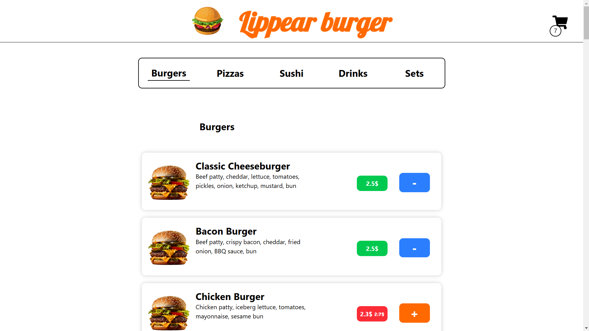
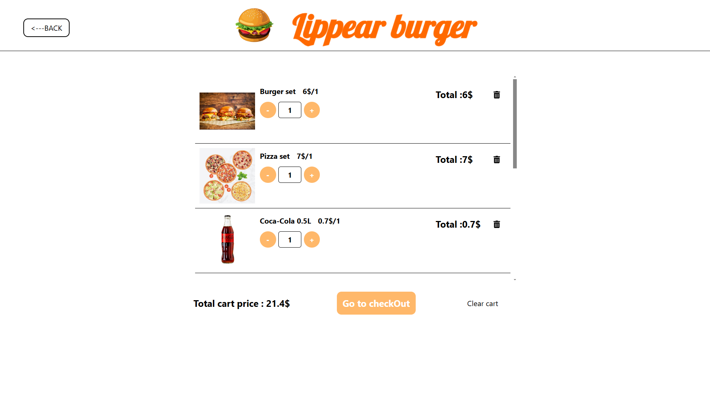
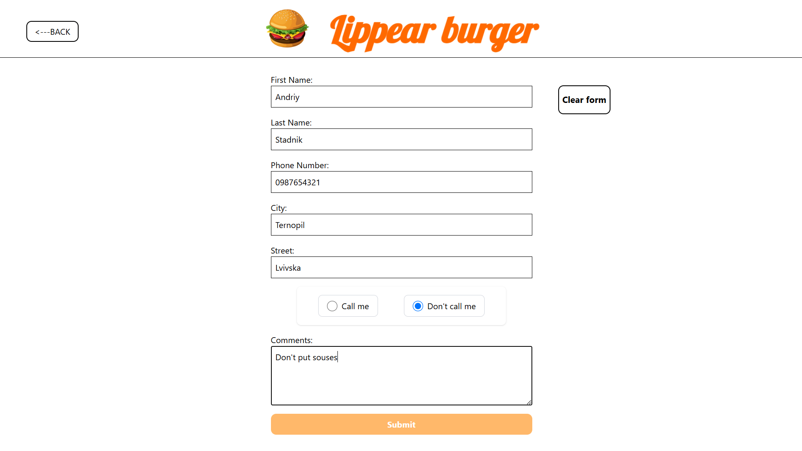

# Lippear burger

## Food ordering and delivery / Замовлення та доставка їжі

## Functionality / Функціональність

- 🔍 Search by category / Пошук за категорією
- 🛒 Add product to cart / Додавання товару в кошик
- ➕ Select quantity of product in cart / Вибір кількості товару в кошику
- 🧾 Place an order / Оформлення замовлення
- 💾 Save user information for future orders / Збереження інформації користувача для майбутніх замовлень

## Technologies / Технології

- React
- TypeScript
- Vite
- Tailwind
- Redux Toolkit
- React Router

### Installation and Setup / Встановлення та запуск

-#### Client-side setup / Налаштування клієнтської частини

1. git clone https://github.com/Lippear/Lippear-burger
2. cd Lippear-burger
3. cd Burger-client
4. yarn install
5. yarn dev

#### Server-side setup / Налаштування серверної частини

6. cd ../burger-server-json
7. npm install
8. node server.js

